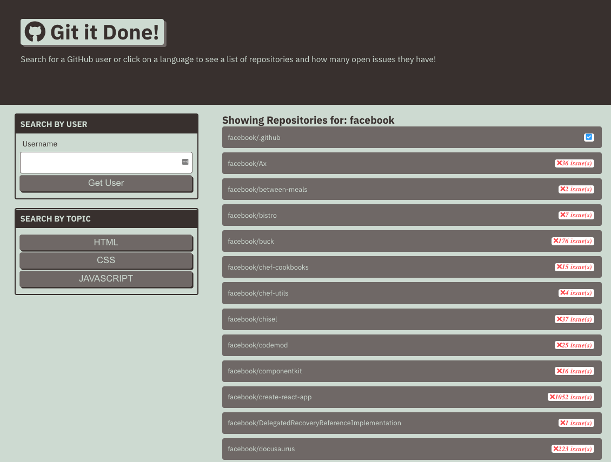
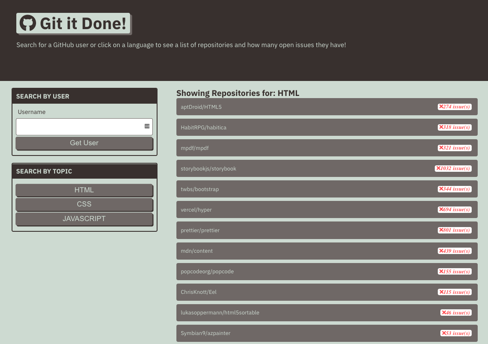

# git-it-done

## Description

The following responsive-application allows the ability to search for open-source issues using GitHub's server-side REST API. You can search by Username (i.e. "Facebook," "Google," "Microsoft," ...etc), or by a categorized language ("HTML," "CSS," or "Javascript").

* Accessed GitHub's website data using server-side API

* Reviewed and applied GitHub's server-side API documentation

* Used the browser's Fetch API to make request to GitHub

* Using the DevTools Network tab, was able to review additional information

* Created dynamic HTTP requests from the brower to capture user input

* Displayed data to a user using an HTTP request's response

* Managed errors that may occur while working with server-side APIs

* Displayed response headers to let user know additional information is available and provided links to redirect

* Leveraged GitHub's API endpoint to request more specified data using optional ? strings

* Used query parameters to pass information from one page to another

* Used `document.location` object to read from a URL query string

### Website:

<a href ="https://joshacross.github.io/git-it-done/">

### Referenced Images

